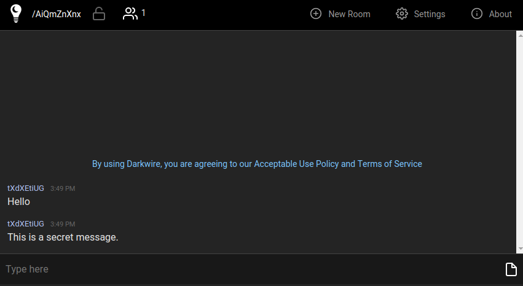
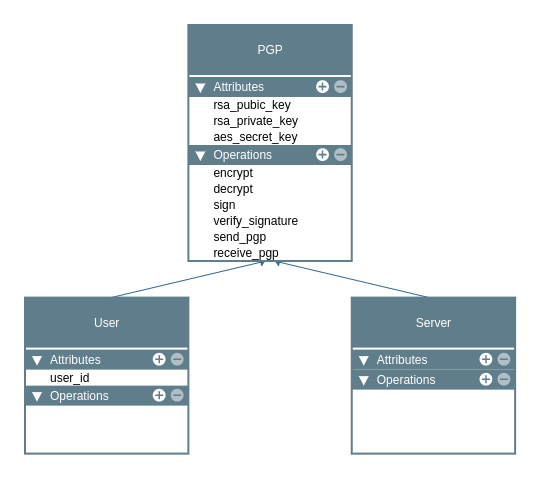
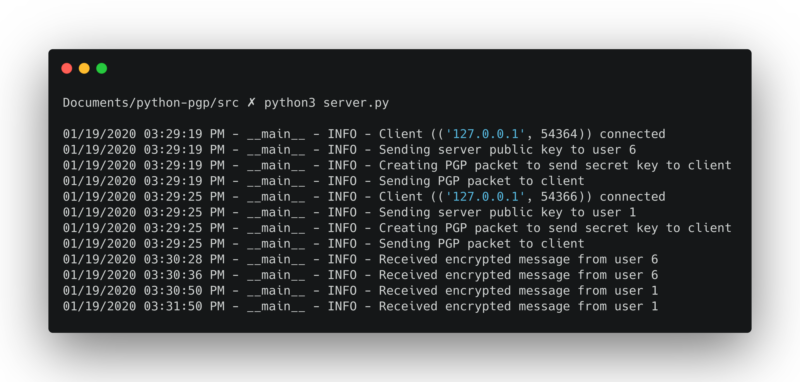
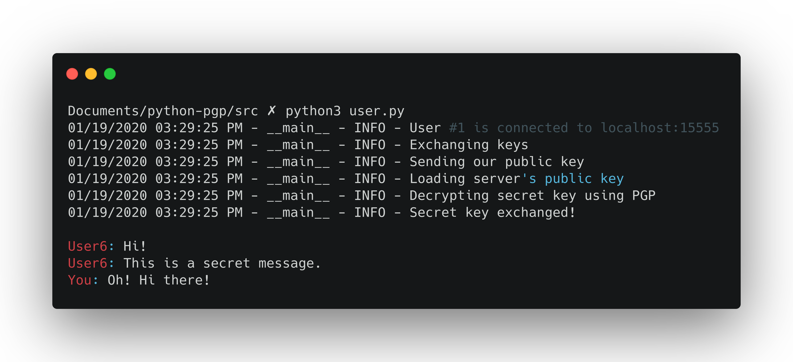

Python PGP Chat
<span style="font-size: 0.5em">Rodolphe GUILLAUME</span>
===

J'ai voulu créer une messagerie chiffrée inspirée de Signal, Telegram ou DarkWire.

Signal a créé son algorithme de chiffrement, TextSecure Protocole, mais celui-ci utilise des courbes elliptiques et je me suis dit que c'était trop ambitieux pour un premier projet en cryptographie.

J'ai donc choisi l'algorithme de PGP, plus simple à appréhender.

L'idée était donc de créer une messagerie chiffrée avec un système de chat room.
Des utilisateurs se connectent à une chat room, s'échangent la clé de chiffrement symétrique puis envoient des messages chiffrés avec AES.



J'ai choisi [cryptography](https://cryptography.io/en/latest/) comme bibliothèque de cryptographie. C'est un choix de facilité puisque nous l'avions vue en cours et qu'elle est bien documentée.


J'ai structuré le projet de la manière suivante :



La classe `PGP` contient toute la logique de cryptographie, que ce soit l'algorithme de PGP pour l'échange de clé, la signature de messages avec RSA ou bien le chiffrement symétrique avec AES.

Pour envoyer les messages, j'ai choisi d'utiliser des `sockets`. Cela m'a semblé être la solution la plus simple pour ce projet.
Les utilisateurs se connecteront à un serveur, et ce dernier s'occupera de diffuser les messages à tous les utilisateurs de la chat room.

# Fonctionnement

Les méthodes `send_pgp_key` et `receive_pgp_key` suivent l'algorithme suivant, qui est la compréhension que j'ai eu de PGP en faisant mes recherches.

```py
# Coté envoyeur

M = 'Plain text message from Sender'

# Signature du message
H = SHA512(M)
EH = RSA_signature(H, Sender.keys.private)

# ZIP du message
message = [M, H]
zipped_message = [zip(m) for m in message]

# Chiffrement du message zippé
secret_key = generate_aes_key()
encrypted_message = [AES_encrypt(m, secret_key) for m in zipped_message]

# Chiffrement de la secret key avec la clé RSA publique du destinataire
encrypted_secret_key = RSA_encrypt(secret_key, receiver_public_key)

# On ajoute la clé au message pour obtenir la liste [Message, Signature, Clé secrète]
encrypted_message.append(encrypted_secret_key)
```

On envoie le message au destinataire. Dans notre cas, cela passera par un socket.

```py
# Coté destinataire

# On recupère la secret key
encrypted_secret_key = encryted_message[2]
secret_key = RSA_decrypt(encrypted_secret_key, self.private_key)

# On dechiffre le message et la signature, qui sont compressés
zipped_message = [AES_decrypt(m, secret_key) for m in encrypted_message[0:2]]

# On dezippe
message = [unzip(m) for m in zipped_message]

# On vérifie la signature du message
H = RSA_decrypt(message[1], sender_public_key)
received_message_hash = SHA512(message[0])
if H != received_message_hash:
    raise exception

# On a notre message secret !
print(message[0])
```

Une fois la clé symétrique échangée via cet algorithme, on peut tout simplement communiquer avec des messages chiffrés avec AES.

# Implémentation

La partie cryptographie s'est révelée être plus compliquée que prévu.

En effet, je n'avais pas anticipé tous les choix et détails que j'aurai à gérer.

Cependant, la documentation de cryptography est suffisament bien faite pour s'y retrouver et réussir à faire des choix.

Pour les clés RSA, j'ai pris les valeurs classiques de configuration.
```py
self._private_key: RSAPrivateKey = rsa.generate_private_key(
    public_exponent=65537,
    key_size=4096,
    backend=default_backend()
)
```

Le plus compliqué a été de choisir les algorithmes de padding pour AES et la signature RSA, et également le mode d'opération pour AES.

Pour le mode d'opération, j'ai choisi `CBC`, sans raison particulière si ce n'est qu'il est dit _cryptographically strong_  par cryptography. Un autre mode d'opération serait peut-être plus adapté à notre cas d'usage.

Ce mode nécessite l'utilisation d'_initialization vectors_ (IV). J'ai donc du les gérer dans mon algorithme de chiffrement.
En effet, on ne peut pas juste générer un IV et le réutiliser à chaque fois. Cryptography recommande d'en générer un pour chaque message chiffré.

> Each time something is encrypted a new initialization_vector should be generated. Do not reuse an initialization_vector with a given key, and particularly do not use a constant initialization_vector.

Pour le padding j'ai choisi PKCS7, car nous avions vu qu'il fallait utiliser PKCS5 en cours de cryptographie l'an dernier.

Je n'ai pas choisi le même padding pour la signature RSA. Cryptography recommendait cette fois-ci PSS.

## Génération de nombres aléatoires

La documentation officielle de python présente la fonction `os.urandom` comme utilisable pour un usage cryptographique.

> Return a string of size random bytes suitable for cryptographic use.

J'ai donc utilisé cette fonction pour générer la clé AES de 256 bits ainsi que les initialization vectors.

# La messagerie

J'avais sous estimé le temps que me prendrait cette partie du projet. La mise en plus du système de chat par socket a été plus longue que prévu.

Le fichier `server.py` est un script en plus de contenir la classe Server. Celui-ci ouvre une socket et gère une pool de sockets client grâce à `select`, un équivalent crossplatform de epoll.
Il en va de même pour le fichier `user.py` qui créer un nouvel utilisateur et se connecte au server.

Comme j'avais pour projet de créer une chat room, il fallait gérer le fait qu'un nombre illimité d'utilisateurs allaient communiquer entre eux, et pas seulement deux.
Pour ce faire, tous les messages passent par le serveur, qui se charge ensuite de les distribuer à tous les utilisateurs connectés.

Ainsi, chaque utilisateur utilise également `select` afin de recevoir les messages des autres utilisateurs, même lorsqu'il est en train de taper un message.

La messagerie fonctionne donc comme suit :

Server:
1. Initialise son socket, sa liste de sockets clients, sa clé AES, ses clés RSA...
2. Attend des messages d'utilisateurs
3. a. Si nouvel utilisateur, échange de clé pour que celui-ci ait la clé AES
3. b. Si nouveau message, broadcast le message chiffré à tous les utilisateurs 

User:

1. Se connecte au serveur
2. Récupère la clé AES auprès du serveur via algorithme PGP
3. a. Boucle infinie pour demander à l'utilisateur d'envoyer des messages
3. b. Reception et affichage des messages des aures utilisateurs

En plus de la partie epoll avec `select` pour gérer la chat room multiutilisateurs, j'ai du créer des "paquets" pour faciliter l'envoi et le traitement des messages.

J'ai donc créé ces dataclasses :

```py
class AESEncryptedData(TypedDict):
    """
    AES encrypted data
    """
    data: bytes  # encrypted data
    iv: bytes  # initialization vector used to encrypt data


class PGPPacket(TypedDict):
    """
    Encrypted data using PGP algorithm.
    """
    signature: AESEncryptedData  # encrypted compressed signature
    data: AESEncryptedData  # encrypted compressed data
    secret_key: bytes  # encrypted secret key used to encrypt signature and data

class SecretMessage(TypedDict):
    op_code: bytes  # b'MSG' or b'KEY' to either send a message or exchange key
    data: Any  # Encrypted message or key
    user_id: int  # User's ID
```

Les utilisateurs et le serveur communique uniquement avec des `SecretMessage`. Cela permet de facilement connaître le type de message (demande d'échange de clé ou simple message chiffré), mais également de savoir qui a émis le message grâce au `user_id` !

La serialisation des messages en bytes a également été compliquée. La structure était trop complexe pour la gérer avec `struct.pack` et l'utilisation de JSON était impossible à cause de l'encodage des bytes.

J'ai donc choisi d'utiliser la bibliothèque `pickle` qui permet de très simplement serialiser ce type d'objets en une ligne.

```py
# Envoi
msg = SecretMessage(op_code=OP_CODE_MSG, data=msg, user_id=user.user_id)
msg: bytes = pickle.dumps(msg)
socket.send(msg)

# Reception
data = socket.recv(4096)
msg: SecretMessage = pickle.loads(data)
```

# Le projet

A cause de l'utilisation des `TypedDict`, python 3.8 est nécessaire.

## Setup de l'environnement

```
python3.8 -m venv venv
source ./venv/bin/activate
pip install -r requirements.txt

cd ./src

python server.py
python user.py
```

## Utilisation





# Axes d'amélioration

Je ne sais pas réellement si la bibliothèque cryptography de python est utilisable dans un contexte professionnel.

D'après ce [thread reddit](https://www.reddit.com/r/Python/comments/5gn3q8/what_crypto_library_should_one_use_in_python/), il vaudrait mieux utiliser libsodium (PyNaCl).

Il faudrait également que je me renseigne mieux sur les différents modes d'opération pour faire un choix éclairé sur le sujet et ne pas prendre CBC par défaut.

Créer un front web avec Flask/Jinja pourrait être une bonne chose également afin de rendre le projet plus simple d'utilisation.

